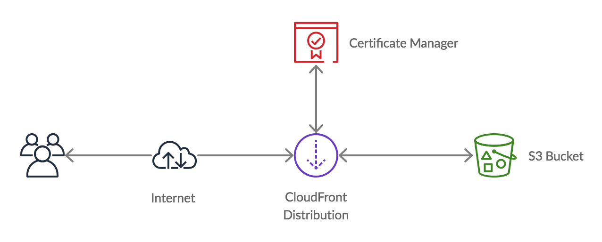
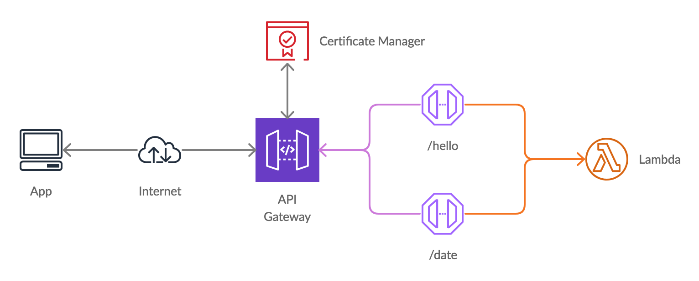
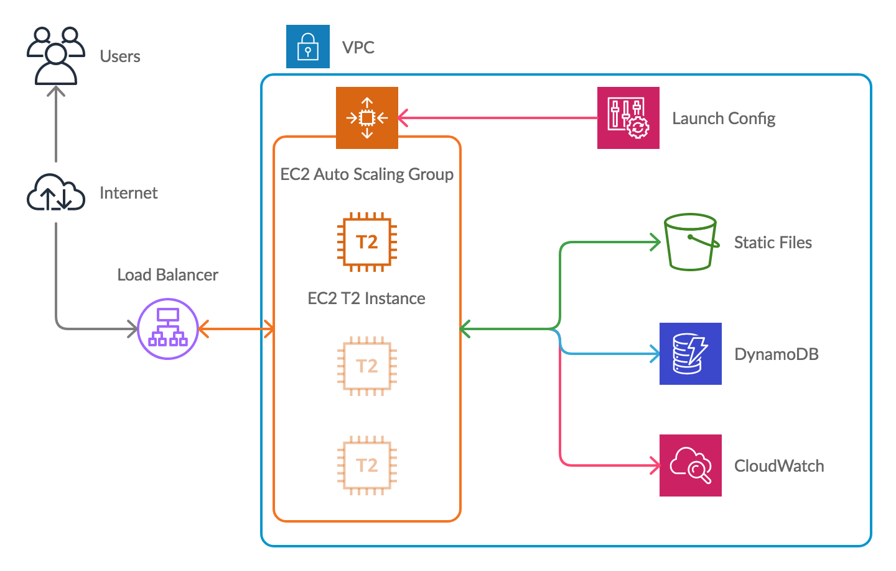

# Jobsity aws-cdk examples

This repo contains 3 examples using AWS-CDK, explained during Jobsity Lunch & Learn.

## Code Organization

```
├── api-lambdas/
├── app-ec2/
├── static-website/
```

|                | Description                             |
| -------------- | --------------------------------------- |
| api-lambdas    | API deployed with API Gateway & Lambdas |
| app-ec2        | App on EC2                              |
| static-website | Static website stored in a S3 bucket    |

### Static Website



### API Lambdas



### App with EC2

